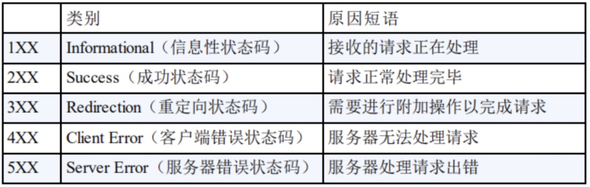

> 如果还可以选择，上大学的时候我一定好好听课，而不是现在为了面试恶补面经，罪过罪过。

> 最近想把看到的想到的，面试题整理一下，作为自己日常学习积累的一部分，没有那些大佬那么专业，仅供参考。

### 浏览器输入URL到显示过程
  图片来源：《图解HTTP》
  

### 三次握手四次挥手
  > 参考 [两张动图-彻底明白TCP的三次握手与四次挥手](https://blog.csdn.net/qzcsu/article/details/72861891)

  

### 常见状态码
  

### HTTP与HTTPS区别
  + https协议需要到ca申请证书，一般免费证书较少，因而需要一定费用。
  + http是超文本传输协议，信息是明文传输，https则是具有安全性的ssl加密传输协议。
  + http和https使用的是完全不同的连接方式，用的端口也不一样，前者是80，后者是443。
  + http的连接很简单，是无状态的；HTTPS协议是由SSL+HTTP协议构建的可进行加密传输、身份认证的网络协议，比http协议安全。